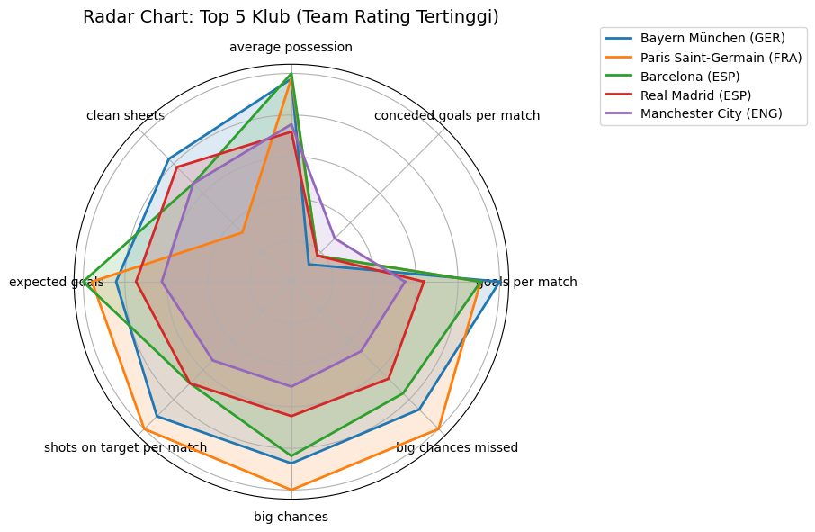

# 📊 Scraping & Visualisasi Data Liga Top 5 Eropa dari Fotmob

Proyek ini merupakan proyek r yang bertujuan untuk mengambil data statistik tim sepak bola dari situs [Fotmob.com](https://www.fotmob.com/), menyimpannya ke dalam basis data MongoDB, serta menyajikannya dalam bentuk visualisasi yang informatif untuk menggali insight dari 5 liga top Eropa.

## 🎯 Tujuan Proyek

- Mengambil data statistik tim (seperti jumlah gol, kebobolan, jumlah kartu kuning) dari **Premier League**, **La Liga**, **Bundesliga**, **Serie A**, dan **Ligue 1**
- Menyimpan data hasil scraping ke dalam basis data **MongoDB**
- Melakukan agregasi data untuk menghasilkan insight seperti:
  - Tim dengan serangan terbaik
  - Tim dengan serangan terbaik
- Menyajikan hasil analisis melalui visualisasi menggunakan **matplotlib**, **seaborn**, dan **plotly**

## 🧰 Teknologi yang Digunakan

- **Bahasa Pemrograman**: Python
- **Scraping**: `requests`, `BeautifulSoup`, `json`, `re`
- **Database**: MongoDB Atlas
- **Visualisasi**: `matplotlib`, `seaborn`, `plotly`
- **Antarmuka Notebook**: Jupyter

## 📁 Struktur Proyek
```
fotmobscrap-analysis/
├── data/
├── images/
├── notebooks/
└── README.md
```
## 🔍 Fitur

- Scraping data statistik tim dari 5 liga besar Eropa
- Penyimpanan data ke MongoDB
- Agregasi performa tim untuk analisis mendalam
- Visualisasi seperti:
  - Bar chart: Tim dengan jumlah gol tertinggi
  - Radar chart: Efektivitas bertahan tim
  - Rasio serangan dan pertahanan
 
## 📊 Contoh Visualisasi



## 📚 PPT

## 🤝 Tim Pengembang
```
Muhammad Syafiq (M0501241005)
Nabillah Rahmatiah Tangke (M0501241070)
Naufalia Alfiryal (M0501241074)
Nabila Fida Millati (M0501241087)
```
